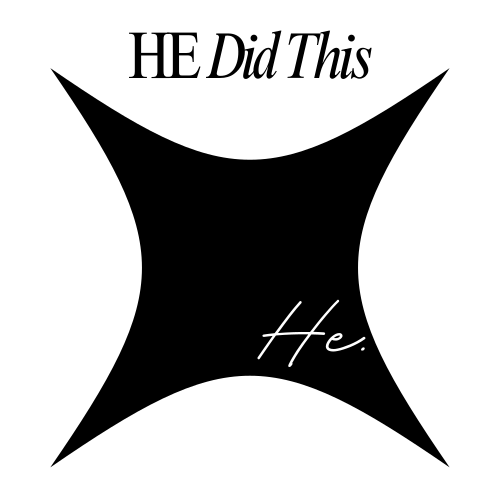

<div align="center">



# 🚀 Portfolio

**Hazem Elgindy — Software Engineer & Full-Stack Developer**

A modern, elegant portfolio website showcasing projects, skills, and experiences with smooth animations and responsive design.


## 🌐 **LIVE PREVIEW**

[](https://hazemelgindy.com/)

**👉 [https://hazemelgindy.com/](https://hazemelgindy.com/) 👈**

</div>

---

## 📋 Table of Contents

- [🤖 Introduction](#-introduction)
- [⚙️ Tech Stack](#️-tech-stack)
- [🔋 Features](#-features)
- [🤸 Quick Start](#-quick-start)
- [🕸️ Project Structure](#️-project-structure)
- [🚀 Deployment](#-deployment)

---

## 🤖 Introduction

This portfolio website is a showcase of Hazem Elgindy's work as a Software Engineer and Computer Science student. It features:

- **Professional Presentation** of skills, projects, and experience
- **Smooth Animations** for an engaging user experience
- **Responsive Design** that works seamlessly across all devices
- **Project Showcase** featuring selected works and technologies used
- **Direct Contact** links to GitHub, LinkedIn, and email

---

## ⚙️ Tech Stack

### Frontend
- **React 19** - Modern UI library with hooks and functional components
- **Next.js 15** - Full-stack React framework with App Router
- **TypeScript** - Type-safe JavaScript development
- **TailwindCSS v3** - Utility-first CSS framework
- **Framer Motion** - Smooth animations and transitions
- **React Fast Marquee** - Animated marquee/ticker component

### Development Tools
- **ESLint** - Code linting and quality assurance
- **PostCSS** - CSS processing and optimization
- **Autoprefixer** - CSS vendor prefixing

---

## 🔋 Features

### 🎯 Core Functionality
- **👉 Hero Section**: Eye-catching introduction with animated profile image
- **👉 About Me**: Comprehensive bio and professional summary
- **👉 Works Showcase**: Display of professional projects and achievements
- **👉 Infinite Marquee**: Animated scrolling technology stack display
- **👉 Work Experience**: Career timeline and professional experience
- **👉 Quick Access**: Direct links to GitHub, LinkedIn, and resume download

### 🎨 User Experience
- **👉 Smooth Animations**: Framer Motion-powered transitions and effects
- **👉 Responsive Design**: Mobile-first approach with TailwindCSS
- **👉 Modern UI**: Clean, minimal design with gradient accents
- **👉 Interactive Elements**: Hover effects and smooth transitions
- **👉 Performance Optimized**: Image optimization and Next.js best practices
- **👉 SEO Ready**: Meta tags, Open Graph, and structured data

### 🔧 Technical Features
- **👉 Type Safety**: Full TypeScript support
- **👉 Server Components**: Optimized with Next.js 15 App Router
- **👉 Image Optimization**: Automatic image processing with Next.js Image component
- **👉 Custom Fonts**: Google Fonts integration for typography
- **👉 Accessibility**: Semantic HTML and ARIA labels for screen readers

---

## 🤸 Quick Start

### Prerequisites

Make sure you have the following installed on your machine:

- **Git** - Version control system
- **Node.js** (v18 or higher) - JavaScript runtime
- **npm** (v9 or higher) - Package manager

### Installation

1. **Clone the repository**
   ```bash
   git clone https://github.com/therealhazem/Portfolio.git
   cd Portfolio
   ```

2. **Install dependencies**
   ```bash
   npm install
   ```

3. **Run the development server**
   ```bash
   npm run dev
   ```

4. **Open your browser**
   Navigate to [http://localhost:3000](http://localhost:3000)

---

## 🕸️ Project Structure

```
Portfolio/
├── app/                          # Next.js App Router
│   ├── globals.css              # Global styles
│   ├── layout.jsx               # Root layout
│   └── page.jsx                 # Homepage
├── src/
│   ├── components/              # Reusable UI components
│   │   ├── Navbar.jsx          # Navigation bar
│   │   ├── Hero.jsx            # Hero section with introduction
│   │   ├── WorksAt.jsx         # Work experience showcase
│   │   ├── InfinityMarque.jsx  # Animated marquee component
│   │   ├── Work.jsx            # Projects showcase
│   │   ├── WorkCard.jsx        # Individual project card
│   │   ├── MyButton.jsx        # Custom button components
│   │   └── Footer.jsx          # Footer section
├── public/
│   ├── images/                 # Image assets (logo, profile, social icons)
│   ├── fonts/                  # Custom font files
│   └── videos/                 # Video assets
├── next.config.js              # Next.js configuration
├── tailwind.config.js          # Tailwind CSS configuration
└── package.json                # Dependencies and scripts
```

---

## 🚀 Deployment

### Vercel (Recommended)

1. **Connect your repository** to Vercel
2. **Deploy** with automatic builds on every push to main branch

### Build & Deploy

```bash
npm run build
npm run start
```

---

<div align="center">

**Made with ❤️ by Hazem Elgindy**

*Fueled by Egyptian Songs & a Lot of Coffee*

**🌐 [hazemelgindy.com](https://hazemelgindy.com)** • **[GitHub](https://github.com/therealhazem)** • **[LinkedIn](https://www.linkedin.com/in/hazemelgindy/)**

[⭐ Star this repo](https://github.com/therealhazem/Portfolio) • [🐛 Report Bug](https://github.com/therealhazem/Portfolio/issues) • [💡 Request Feature](https://github.com/therealhazem/Portfolio/issues)

</div>
